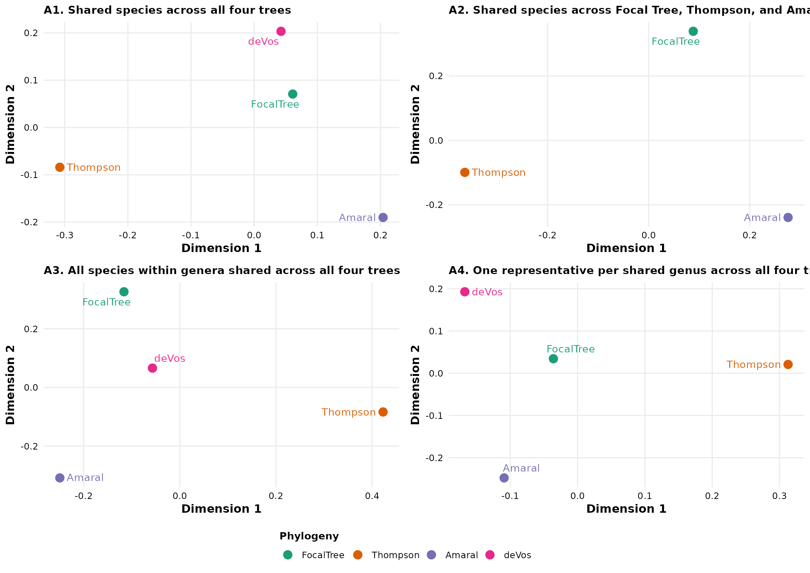

# Tutorial 4: Phylogenetic Validation and Sub-tree Comparisons

### Module 13: Sub-trees and Phylogenetic Validation

The final stage of the `PhyloCactus` framework evaluates topological
stability and comparative congruence between the inferred evolutionary
hypothesis and external reference backbones.

Although maximum-likelihood inference provides a statistically evaluated
estimate of evolutionary relationships, the resulting supermatrix
topology represents a single analytical hypothesis. In rapid plant
radiations such as **Cactaceae**, topological recovery can be influenced
by taxon sampling, locus selection, substitution model parametrization,
and analytical strategy.

This module quantifies topological agreement between the focal
maximum-likelihood supermatrix tree generated by `PhyloCactus` and
previously published phylogenomic hypotheses. Validation employs
quantitative tree comparison metrics, including Robinson–Foulds (RF)
distances, normalized topological distances, and multidimensional
scaling (MDS) tree-space projections. These approaches establish an
objective framework to identify congruent evolutionary clades, pinpoint
conflicting topologies, and evaluate the placement of major cactus
lineages across alternative phylogenomic datasets.

#### Sourcing External Trees and `ASTRAL-III`

Reference phylogenetic hypotheses and external analytical binaries are
not distributed within `PhyloCactus` to avoid licensing restrictions and
large file distribution. Users independently acquire published reference
trees prior to running the comparative validation workflow.

The validation protocol compares the focal supermatrix topology against
three representative phylogenomic frameworks: the spatial phylodiversity
tree of Amaral *et al.* (2022; *Biological Conservation*, 273), the
macroevolutionary chronogram of Thompson *et al.* (2024; *Nature
Communications*, 15), and the nuclear target-capture dataset of de Vos
*et al.* (2025; *Plant Systematics and Evolution*, 311).

#### Gene Tree Summaries with `ASTRAL-III` under Multispecies Coalescence

In multilocus and target-capture datasets, individual gene trees
frequently display topological discordance. Rather than reflecting
analytical noise, this discordance stems from primary biological
processes, including Incomplete Lineage Sorting (ILS), reticulate
evolution, ancient hybridization, and plastid capture. Because gene
coalescence occurs within the bounds of ancestral species lineages,
concatenated supermatrix approaches can occasionally suffer from
inconsistency under high ILS.

To explicitly account for biological discordance, `PhyloCactus`
incorporates the summary species-tree estimator **`ASTRAL-III`**.
Operating under the multispecies coalescent (MSC) framework,
`ASTRAL-III` infers a species tree topology from a collection of
unrooted gene trees, minimizing deep coalescent events. This provides a
coalescent-based reference hypothesis to compare directly against the
concatenated maximum-likelihood reconstruction.

The `ASTRAL-III` Java executable (`.jar`) is downloaded separately by
the user before running the coalescent summary workflow.

#### Using `.Renviron` to Manage Paths Safely

When dealing with personal file paths (to software like `ASTRAL-III` or
locally downloaded trees), it is highly recommended to use the
`.Renviron` file. This avoids exposing your local machine paths on the
internet or in your shared code.

``` r

# Add these lines to your ~/.Renviron file (e.g., using usethis::edit_r_environ())
# ASTRAL_PATH="/path/to/astral.5.7.8.jar"
# DEVOS_GENETREES_PATH="/path/to/QC.bestTreeCollapsed.trees"
# DEVOS_METADATA_PATH="/path/to/606_2025_1948_MOESM1_ESM.csv"

# Then access them safely in R:
astral_jar <- Sys.getenv("ASTRAL_PATH")
gene_trees_file <- Sys.getenv("DEVOS_GENETREES_PATH")
metadata_file <- Sys.getenv("DEVOS_METADATA_PATH")
```

#### Standardizing Metadata and Running `ASTRAL`

*Context: Why use `ASTRAL-III`?* The study by de Vos *et al*. (2025) is
a phylogenomic study utilizing the *Angiosperms353* target capture kit.
Because their analysis was centered primarily at the genus level, it
provides an excellent framework for testing topological congruence
against our supermatrix approach. However, because the authors provided
individual gene trees rather than the final coalescent species tree, we
must infer the species tree using `ASTRAL-III` to properly account for
gene tree discordance (e.g., resulting from incomplete lineage sorting)
prior to our comparative analyses.

Using the gene trees and metadata (e.g., from de Vos et al., 2025), you
can map sample names and export renamed gene trees directly to
`ASTRAL-III`.

``` r

# Load Metadata safely from where you downloaded it
meta <- read.csv(Sys.getenv("DEVOS_METADATA_PATH"), check.names = FALSE)

# Create mapping vector
map_sample <- setNames(gsub(" ", "_", meta$`Scientific name`), stringr::str_extract(meta$`Name in tree`, "P[0-9]+"))

# Load and safely rename tips of gene_trees
gene_trees <- ape::read.tree(Sys.getenv("DEVOS_GENETREES_PATH"))
# ... (Iterate over the gene trees, apply mappings, and write to a new file) ...

# Execute `ASTRAL` directly via system command
cmd <- paste("java -jar", Sys.getenv("ASTRAL_PATH"), 
             "-i", "renamed_gene_trees.tre", 
             "-o", "QC.Species_tree_astral.tree")
system(cmd)
```

### Evaluating Topological Congruence Across Alternative Hypotheses

Once external phylogenetic hypotheses have been downloaded, and new
`ASTRAL` species trees inferred, we evaluate topological congruence
against our focal maximum likelihood tree (e.g., the treePL chronogram)
and a set of external trees.

Topological congruence is quantified using Robinson–Foulds (RF)
distances and related tree comparison metrics. These analyses measure
the number of shared and conflicting bipartitions among alternative
phylogenetic hypotheses, allowing researchers to identify the degree of
agreement among datasets generated under different taxon sampling
schemes, molecular evidence, and inference frameworks.

For visualization of relationships among alternative hypotheses,
normalized RF distances are summarized using multidimensional scaling
(MDS). This ordination approach represents phylogenetic hypotheses in a
reduced dimensional space, where closer positions indicate greater
topological similarity and larger distances indicate stronger
disagreement.

**Rendering note:** To allow this vignette to execute reproducibly
without requiring external downloads during package installation,
example reference trees are distributed within the `PhyloCactus`
`extdata` directory. Users applying this workflow to their own datasets
should replace these example files with independently downloaded
published hypotheses or newly generated ASTRAL species trees.

``` r

library(PhyloCactus)

# List of collected trees - fetching from extdata for the package vignette
tree_paths <- list(
  FocalTree   = system.file("extdata", "dated_summary_hpd.tree", package = "PhyloCactus"),
  Thompson    = system.file("extdata", "ultra_cacti_JT.tre", package = "PhyloCactus"),
  Amaral      = system.file("extdata", "Tree_80MD.tre", package = "PhyloCactus"),
  deVos       = system.file("extdata", "QC.Species_tree_astral.tree", package = "PhyloCactus")
)

# Filter missing trees to allow the vignette to build even if you haven't uploaded them yet
existing_trees <- tree_paths[sapply(tree_paths, function(x) file.exists(x) && nzchar(x))]

plot_to_show <- NULL
table_to_show <- NULL

if(length(existing_trees) > 1) {
  checklist_file   <- system.file("extdata", "CactaceaeFullList_accepted.csv", package = "PhyloCactus")
  constraints_file <- system.file("extdata", "cactus_constraints.csv", package = "PhyloCactus")
  
  # The validate_phylogenies wrapper handles tip harmonization, Robinson-Foulds/DPI distance
  # calculations, and tree-space projections automatically.
  validation_outputs <- validate_phylogenies(
    trees_mapping_list = existing_trees,
    checklist_csv = checklist_file,
    constraints_map = constraints_file,
    out_dir = file.path(tempdir(), "10_Validation")
  )
  
  plot_to_show <- validation_outputs$plot
  
  dist_table <- read.csv(file.path(validation_outputs$tables, "TABLE_pairwise_tree_distances_main.csv"))
  table_to_show <- head(dist_table)
} else {
  message("Please upload the reference trees to inst/extdata/ to run the full validation.")
}

plot_to_show
```



| analysis_id | analysis_label | metric | tree_1 | tree_2 | n_common_tips | distance |
|:---|:---|:---|:---|:---|---:|---:|
| A1_species_all4 | A1. Shared species across all four trees | RF | Thompson | FocalTree | 66 | 0.4285714 |
| A1_species_all4 | A1. Shared species across all four trees | RF | Amaral | FocalTree | 66 | 0.3492063 |
| A1_species_all4 | A1. Shared species across all four trees | RF | deVos | FocalTree | 66 | 0.2698413 |
| A1_species_all4 | A1. Shared species across all four trees | RF | Amaral | Thompson | 66 | 0.5238095 |
| A1_species_all4 | A1. Shared species across all four trees | RF | deVos | Thompson | 66 | 0.4603175 |
| A1_species_all4 | A1. Shared species across all four trees | RF | deVos | Amaral | 66 | 0.4285714 |

Pairwise tree distances {.table}

The resulting `TABLE_pairwise_tree_distances_main.csv` and the
multidimensional tree-space projections (`FIG_tree_space_main.pdf`)
provide a quantitative framework for assessing topological congruence
among alternative phylogenetic hypotheses. Together, these outputs allow
researchers to identify regions of agreement and disagreement across
studies, evaluate the robustness of major clades, and determine whether
differences arise from taxon sampling, molecular marker selection, or
phylogenetic inference methodology. This comparative validation provides
an objective measure of confidence in the inferred evolutionary
relationships before downstream macroevolutionary, biogeographic, or
comparative analyses.

## Conclusion

This concludes the complete `PhyloCactus` phylogenetic inference
pipeline. Across the four tutorials, you have assembled a curated
multilocus supermatrix from public sequence repositories, inferred a
robust maximum-likelihood phylogeny, estimated divergence times using
penalized likelihood with temporal bootstrap confidence intervals,
integrated conservation metadata from the IUCN Red List, generated
publication-ready visualizations, and quantitatively validated your
phylogenetic hypothesis against alternative published backbones.

The resulting datasets including aligned supermatrices, maximum
likelihood trees, time calibrated chronograms, species metadata tables,
conservation summaries, and comparative validation metrics—provide a
reproducible foundation for downstream analyses in macroevolution,
historical biogeography, conservation biology, community ecology, and
comparative evolutionary research. By combining automated data
acquisition, rigorous quality control, standardized phylogenetic
inference, and transparent analytical workflows, `PhyloCactus` enables
researchers to construct large scale evolutionary datasets that are
readily reproducible, extensible, and suitable for publication quality
comparative studies.
