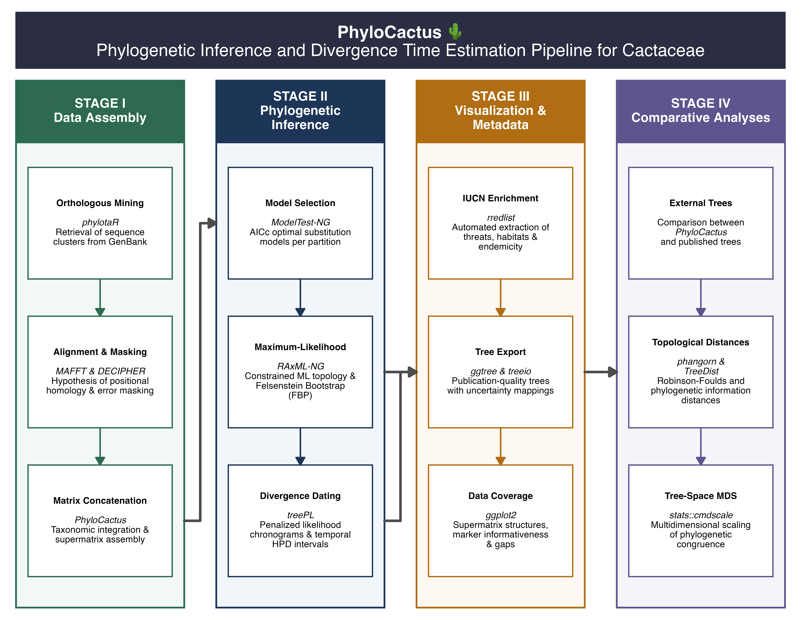

```{r setup, include = FALSE}
knitr::opts_chunk$set(
  collapse = TRUE,
  comment = "#>"
)
```

## Welcome to PhyloCactus

`PhyloCactus` is an R package for assembling, curating, and analysing multilocus phylogenetic datasets from publicly available DNA sequences. The package integrates sequence retrieval from GenBank, quality control, phylogenetic inference, divergence time estimation, visualization, and validation into a single reproducible, scientifically curated framework.

Although originally developed for evolutionary studies of **Cactaceae**, a clade exhibiting recent evolutionary radiations, incomplete lineage sorting, and reticulate evolution (Arakaki *et al*. 2011; Hernández-Hernández *et al*. 2014; Guerrero *et al*. 2019), the analytical workflow is designed to be broadly applicable to plant evolutionary research involving heterogeneous GenBank datasets.

Rather than developing novel phylogenetic algorithms, `PhyloCactus` orchestrates established bioinformatics software into a coherent methodological pipeline. This approach standardizes complex phylogenetic analyses while preserving computational reproducibility, methodological transparency, and biological interpretability.

## Why PhyloCactus?

Constructing reliable multilocus phylogenetic datasets from public sequence repositories presents a significant methodological challenge in evolutionary research. Researchers typically encounter inconsistent annotations, pervasive taxonomic synonymy, duplicated accessions, and heterogeneous sequence quality. Transforming these records into high-quality datasets requires complex procedures to establish positional homology, remove non-homologous segments, and control mutational heterogeneity before estimating topological structure and divergence times.

Although established external software exists for individual analytical components, integrating these tools into a scientifically defensible and reproducible workflow typically requires ad hoc computational intervention, which obscures methodological transparency and impedes reproducibility.

`PhyloCactus` addresses this challenge by providing a modular framework that strictly standardizes each analytical step according to accepted systematic practices. By organizing the workflow so that biological questions dictate methodological decisions, the package ensures that outputs generated by one stage serve as documented inputs for the next, guaranteeing computational reproducibility from initial sequence retrieval to final topological inference.

## Workflow Overview

The complete `PhyloCactus` workflow is organized into **four analytical stages** comprising **thirteen interoperable modules**.

```{r workflow-fig, echo=FALSE, out.width="100%", fig.align="center", fig.cap="Conceptual framework of the PhyloCactus pipeline"}
 
```

Each stage can be executed independently or combined into a fully reproducible phylogenetic workflow.

## Main Capabilities

The `PhyloCactus` framework integrates sequence acquisition, data curation, evolutionary modeling, tree inference, temporal calibration, metadata enrichment, and topological validation into a single workflow. Specifically, the package automates the retrieval of homologous DNA sequences from GenBank via `phylotaR`, infers positional homology using `MAFFT`, and applies objective quality control masking through `DECIPHER`. Following taxonomic nomenclature standardization and supermatrix concatenation, `PhyloCactus` evaluates nucleotide substitution models using `ModelTest-NG`, infers maximum-likelihood phylogenies with `RAxML-NG`, and estimates divergence times under penalized likelihood using `treePL`. Finally, the suite integrates macroevolutionary conservation categories from the IUCN Red List (`rredlist`), renders publication-ready tree visualizations, and quantifies comparative topological agreement across alternative phylogenomic hypotheses.

## Installation

### Install PhyloCactus

Install the development version directly from GitHub:

``` r
if (!requireNamespace("remotes", quietly = TRUE))
  install.packages("remotes")

remotes::install_github("beeamerino/PhyloCactus")
```

Verify that the package has been installed:

``` r
library(PhyloCactus)

packageVersion("PhyloCactus")
```

### R Package Dependencies

`PhyloCactus` relies on packages available from both CRAN and Bioconductor:

| Repository | Main packages |
|:-----------------------------------|:-----------------------------------|
| **remotes** | `phylotaR` |
| **Bioconductor** | `DECIPHER`, `Biostrings` |
| **CRAN** | `ape`, `ggplot2`, `dplyr`, `tidyr`, `readr`, `stringr`, `purrr`, `rredlist`, `forcats`, `scales`, `RColorBrewer` |

Install the required **Bioconductor** packages using:

``` r
if (!requireNamespace("BiocManager", quietly = TRUE))
    install.packages("BiocManager")

BiocManager::install(c("DECIPHER", "Biostrings"))
```

#### phylotaR

[`phylotaR`](https://github.com/ropensci/phylotaR) (Bennett *et al.* 2018) is an automated R package that identifies and downloads orthologous DNA sequences from GenBank by using BLAST clustering instead of relying on inconsistent gene names. Install `phylotaR` from GitHub via `remotes` using:

``` r
if (!requireNamespace("remotes", quietly = TRUE))
    install.packages("remotes")

remotes::install_github('ropensci/phylotaR')
```

## External Software

Several analyses implemented in `PhyloCactus` rely on external command-line software. These programs must be installed separately and be available from your system `PATH`:

| Software | Purpose | Citation |
|:-----------------------|:-----------------------|:-----------------------|
| [`BLAST+`](https://www.ncbi.nlm.nih.gov/books/NBK279690/) | Local sequence alignment and database searching | Camacho, C. *et al*. (2009). BLAST+: Architecture and applications. *BMC Bioinformatics*, 10. <https://doi.org/10.1186/1471-2105-10-421> |
| [`MAFFT`](https://mafft.cbrc.jp/alignment/software/) | Multiple sequence alignment | Katoh, K., & Standley, D. M. (2013). MAFFT multiple sequence alignment software version 7: Improvements in performance and usability. *Molecular Biology and Evolution*, 30(4), 772–780. <https://doi.org/10.1093/molbev/mst010> |
| [`ModelTest-NG`](https://github.com/ddarriba/modeltest) | Model selection | Darriba, D. *et al*. (2020). ModelTest-NG: a new and scalable tool for the selection of DNA and protein evolutionary models. *Molecular Biology and Evolution*, 37(1), 291-294. <https://doi.org/10.1093/molbev/msz189> |
| [`RAxML-NG`](https://github.com/amkozlov/raxml-ng) | Maximum-likelihood phylogenetic inference | Kozlov, A. M. *et al*. (2019). RAxML-NG: A fast, scalable and user-friendly tool for maximum likelihood phylogenetic inference. *Bioinformatics*, 35(21), 4453–4455. <https://doi.org/10.1093/bioinformatics/btz305> |
| [`treePL`](https://github.com/blackrim/treePL) | Divergence time estimation | Smith, S. A., & O’Meara, B. C. (2012). TreePL: Divergence time estimation using penalized likelihood for large phylogenies. *Bioinformatics*, 28(20), 2689–2690. <https://doi.org/10.1093/bioinformatics/bts492> |

### Configuring the System PATH

If any executable cannot be detected by R, add its installation directory to your system `PATH`. One convenient approach is to edit your `.Renviron` file:

``` r
usethis::edit_r_environ()
```

For example:

``` bash
PATH="/Users/**your_user**/miniconda3/bin:${PATH}"
```

After saving the file, restart your R session so the updated environment variables become available.

## Package Design

`PhyloCactus` follows a modular architecture in which each function performs a single, well-defined analytical task. Outputs generated by one stage become the documented inputs for the next stage, allowing the pipeline to be executed sequentially while maintaining complete computational transparency. This modular design ensures that analyses can be resumed seamlessly from intermediate stages, standardized output structures facilitate empirical reproducibility, individual modules can be flexibly incorporated into custom phylogenetic workflows, and debugging is simplified because each stage produces independent, verifiable log files.

## Typical Output Structure

Most pipeline stages generate standardized output directories containing FASTA sequence files, multiple sequence alignments, metadata tables, manifest files, partition files, Newick phylogenetic trees, and summary reports. Maintaining a consistent directory structure allows analyses to be restarted from any completed stage without repeating computationally intensive upstream steps.

## Learning Pathway

The recommended way to learn `PhyloCactus` is by completing the tutorials in sequence:

| Tutorial | Description |
|:-----------------------------------|:-----------------------------------|
| [**Tutorial 1**](https://beeamerino.github.io/PhyloCactus/articles/tutorial-1-cactus-phylogeny-prep.html) | Data Assembly and Preparation |
| [**Tutorial 2**](https://beeamerino.github.io/PhyloCactus/articles/tutorial-2-cactus-phylogeny-inference.html) | Phylogenetic Inference and Divergence Time Estimation |
| [**Tutorial 3**](https://beeamerino.github.io/PhyloCactus/articles/tutorial-3-cactus-phylogeny-visualization.html) | Visualization and Metadata Integration |
| [**Tutorial 4**](https://beeamerino.github.io/PhyloCactus/articles/tutorial-4-cactus-phylogeny-validation.html) | Phylogenetic Validation and Comparative Analyses |
| [**Function Reference**](https://beeamerino.github.io/PhyloCactus/articles/tutorial-5-cactus-phylogeny-functions.html) | Complete reference of package functions |

## Next Steps

Once `PhyloCactus` and its external dependencies have been successfully installed, continue with [Tutorial 1: Data Assembly and Preparation](https://beeamerino.github.io/PhyloCactus/articles/tutorial-1-cactus-phylogeny-prep.html), where you will assemble a curated multilocus dataset directly from GenBank using the complete data preparation workflow implemented in the package.

## References

- Arakaki *et al*. 2011. Contemporaneous and recent radiations of the world’s major succulent plant lineages. *Proceedings of the National Academy of Sciences of the United States of America*, 108(20), 8379–8384. <https://doi.org/10.1073/pnas.1100628108>
- Bennett *et al*. 2018. Phylotar: An automated pipeline for retrieving orthologous DNA sequences from GenBank in R. *Life*, 8(2), 20. <https://doi.org/10.3390/life8020020>
- Hernández-Hernández *et al*. 2014. Beyond aridification: Multiple explanations for the elevated diversification of cacti in the New World Succulent Biome. *New Phytologist*, 202(4), 1382–1397. <https://doi.org/10.1111/nph.12752>
- Guerrero *et al*. 2019. Phylogenetic Relationships and Evolutionary Trends in the Cactus Family. *Journal of Heredity*, 110(1), 4–21. <https://doi.org/10.1093/jhered/esy064>

